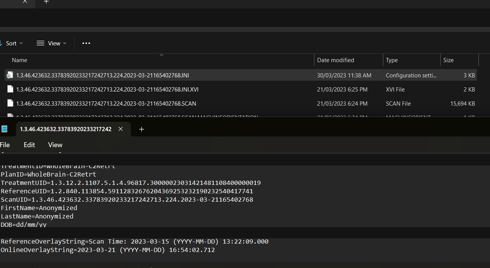
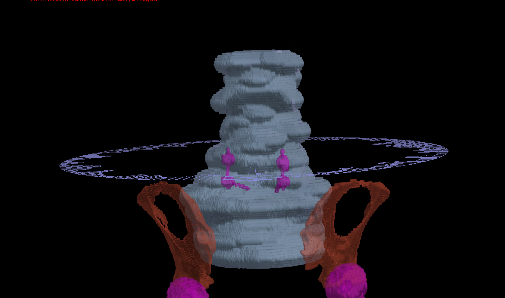
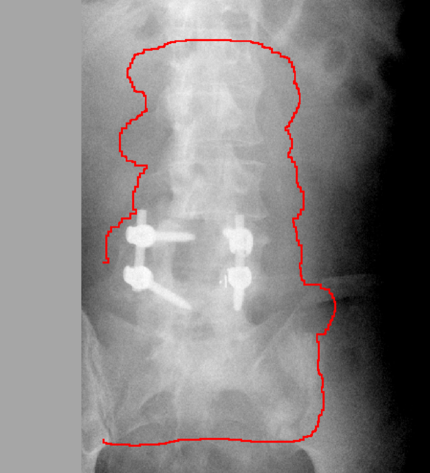
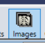
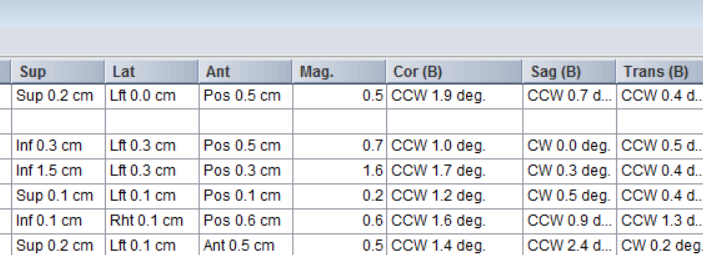
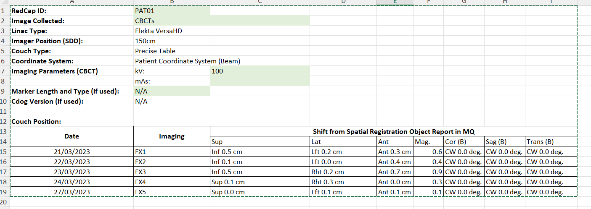
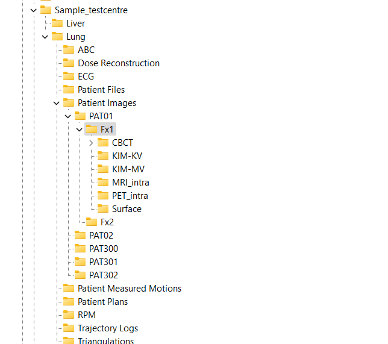
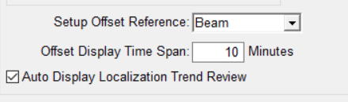

# GC Elekta Patient Upload Process to USYD RDS/research/PRJ-LEARN

## Purpose of document

This document serves as the SOP for patient data transfer to LEARN from PRIME datastore and from the Elekta_fdt datastore. This is to be used in conjunction with the USYD transfer WIs which address patient registration in RedCAP, connectivity and folder structure in more detail.

## For PRIME Data Transfer

The Site Physicist of each PRIME site will move PRIME related data to the PRIME Data Store (internal SharePoint).

What needs to be in PRIME datastore patient folder:

- XVI file export
- XVI Calibration files at the time of fraction. If calibration occured mid treatment then all copies of calibration files.
- Monaco export patient.
- KIM Trajectory Logs
- KIM Centroid File

The PRIME TCP/ImageX-RA will be responsible for the rest of the process below. Only the sessions with SFOV CBCTs need to be transferred to the LEARN data base. Ignore sessions with MFOV CBCTs.

<**to be expanded**/copy from PRIME workflow doc>

## For Elekta_fdt Data Transfer

### Overall Steps

1. Check if minimum data requirements for patient registration and imaging data are met.
2. Register patient in redcap and uploade consent form.
3. Update the patient log (internal SharePoint: LEARN Teams > General Channel > LEARN_Documents > Patient Data Log.xlsx).
4. Sort and anonimise using [learn_upload](https://github.com/kkaan/learn-crawler-releases).

Before registering the patient in redcap check if patient data meets the minimum requirement:

1. Height/weight information in MQ assessments (Vital Signs) during the treatment period. This requirement might be revisited at a subsequent revision.
2. Projections with target within the 180 degree frames using the [patient selection utility](https://github.com/Image-X-Institute/contour-alignment-tool).
3. RPS.dcm with registration and shift values available in XVIclinical folder and MQ

Open the Patient Data Log.xlsx (internal SharePoint, LEARN Teams > General Channel). This is a list of patients in the Elekta_FDT folder. Go to the site folder in elekta_fdt and select an unprocessed patient on the worksheet.

elekta_fdt folder name contains the MRN. Open patient in Mosaiq.
Check if vitals has age and height details.
Check if there are registration shifts have been uploaded as required into MQ.

Scan UID of the CBCT has date and time embedded in it if you need to cross-reference to ensure correct plan is exported from Monaco:
One place to get it is in one of the .ini files in IMAGES\img_1.3.46.423632.337839202332931827841.8\Reconstruction.
Date and time of CBCT:
ScanUID=1.3.46.423632.33783920233217242713.224.2023-03-21165402768

Open patient in Monaco. If not in the default location, retrieve from archive (ensuring the usual precautions for retrieval is followed so it doesn't overwrite any data). Open the correct plan (using the date and reference meta-data of first fraction CBCT). Export to a staging folder in the local drive where you have copied the XVI data.

## Target in projections check

Open **Contour Alignment Tool** from imageX and follow instructions in [https://github.com/Image-X-Institute/contour-alignment-tool.git](https://github.com/Image-X-Institute/contour-alignment-tool.git) to get to view the contour overlayed on projections. Use 3D view in Monaco to verify and adjust contour location against the projections.

NB: loading the CT happens quickly but the "Generate structure volume mask" takes a long time if on share drive. Looks like it's stalled but it has not. Wait...

To assess whether the PTV is within the target when this utility fails to register the contour properly:

1. Check image is SFOV (come back to MFOV images if more patients are needed)
2. Open up patient in Monaco in 3D view and at the same time have the contour alignment tool open. Use both to guide where the PTV will be on the patient anatomy.

## Patient Details and shifts from Mosaiq Images List

The required patient details report will be generated by [`report_patient_details.py`](../cbct-shifts/report_patient_details.py). This replaces the excel file template usage that is described below.

> **Warning:** The generated report has not been independently verified. Always cross-check the reported shift values against the values recorded in Mosaiq before use.

The image list SRO browser can also be used to validate and fill in CBCT shifts in patient coordinates. Use the excel template for this if needed. The required data in this is in the RPS file that will be exported along with the images.

The registration results applied and shifted to and from that fraction's CBCT is listed here in patient coordinates. You can highlight and copy these values to the patient details spreadsheet.

Note for GC the coordinate system setting in MQ is globally set to "Patient Coordinate System (Beam)". See [Appendix](#appendix) to check if it's set to 'beam' or 'anatomy' for your institution.

## Anonymisation and Folder Sorting

Anonymisation and folder sorting are now handled by the **LEARN Pipeline GUI** (`python -m learn_upload`). This replaces the previous MIM-based anonymisation workflow.

The GUI wizard automates the following steps:

1. **Folder Sort** -- copies XVI export files into the LEARN directory structure
2. **DICOM Anonymisation** -- strips patient-identifiable information from DICOM files and assigns PATxx sequential IDs
3. **PII Verification** -- scans output files for any residual patient-identifiable data
4. **CBCT Shift Report** -- extracts couch shift values from RPS registration files

See the [GUI Walkthrough](GUI_Walkthrough.md) for the full step-by-step guide.

> **Note:** The utility supports automatic copying of calibration files. In the Configuration step, use the **Calibrations Dir** field to point to the `Current Calibration` folder. The pipeline will copy it into each fraction folder under Patient Images.

## Transfer

Instructions: LEARN data collection15May2025.pdf (internal SharePoint, LEARN Teams > General Channel)

Use the SFTP (cyberduck or WinSCP) to connect and place files in LEARN folder as per folder structure specified in the Sample_testcentre.

Check the actual folder in LEARN as the recommended structure might have been updated since the time of screen shot below.

GC is only providing CBCTs at this stage so the reconstructed CBCTs, registration objects and the projection files will be in the PATxx >> FXxx > CBCT folder. **Only include the CBCTs on which shifts were applied and treated.**

## Appendix

### Definitions from Mosaiq 2.83 help file

**Images list column definitions.**

| Parameter | Description |
| --------- | ----------- |
| Sup | Displays the magnitude of the superior or inferior offset of the image in centimeters. |
| Lat | Displays the magnitude of the left or right offset of the image in centimeters. |
| Ant | Displays the magnitude of the anterior or posterior offset of the image in centimeters. |
| Mag. | Displays the offset vector magnitude. |
| Cor (B) | Displays the coronal angular correction in degrees. |
| Sag (B) | Displays the sagittal angular correction in degrees. |
| Trans (B) | Displays the transverse angular correction in degrees. |

### Setup Offset Reference

Select the offset reference to be used by Image Management. Setup corrections on images are described in patient coordinates (Ant/Post, Sup/Inf, R/L). You can select Beam or Anatomy to determine the direction in which to move the beam. These selections configure the MOSAIQ system to show setup corrections direction relative to beam parameters or patient anatomy shown in the image.

The settings are opposite of each other. If you move the patient in the inferior direction, the isocenter moves in the superior direction.

If you select Beam, offsets show the direction the displayed isocenter/aperture must move across the displayed anatomy to align with the planned target position. If you select Anatomy, offsets show the direction the patient must move below the immobile beam. The default is Beam.

These options configure the system to show setup corrections direction relative to beam parameters or patient anatomy viewed in the image.

- **Beam:** The direction the current beam references (jaw/isocenter) must move to align with the target anatomy.
- **Anatomy:** The direction target anatomy shown in the image must move to align with the displayed beam references.

Department configuration for Setup Offset Reference at GC is **Beam**.

